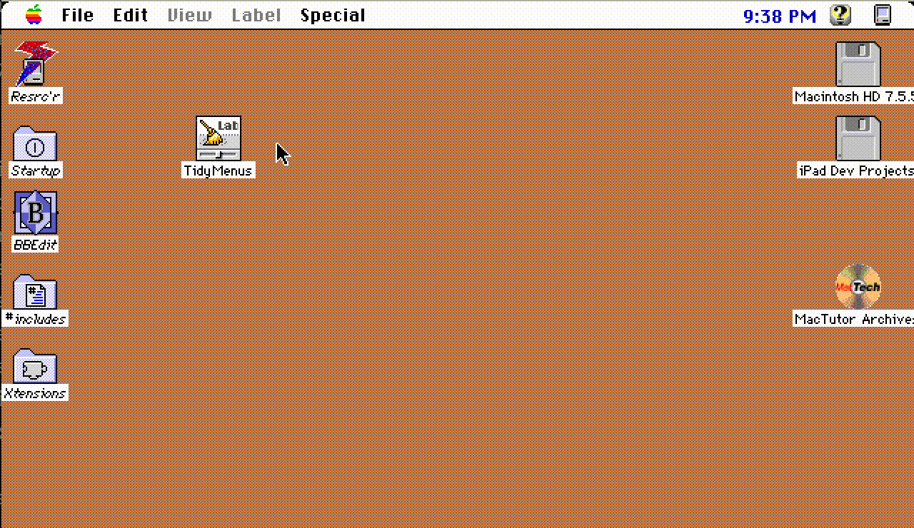

# TidyMenus

I'm happy to share TidyMenus, a simple little Control Panel for System 7 and 8 that can:

- Hide/Show the **Help menu** in all applications
- **Re-show the Help menu across all applications at any time**, just by opening the
  Control Panel and unchecking the box, without restarting (this was the hard part —
  to my knowledge no other INIT/cdev offers this feature)
- Hide/show the **Label menu** in the Finder under System 7. The hidden Label menu
  appears and operates as a hierarchical submenu under the 'File' menu — as in
  System 8. You can pop it back to the menubar or return it to a submenu with no
  restart required.
- Works correctly for non-English systems, unlike the original NoLabel
- You can hide the Label menu "out of the box" just by opening the cdev and checking
  the box without installing anything or restarting (though of course you'll want to
  install this if you want to keep the Label menu hidden permanently)

Ready-to-use downloads live at
**[Macintosh Garden](https://macintoshgarden.org/apps/tidymenus)**; discussion at
[68kmla](https://68kmla.org/bb/index.php?threads/presenting-tidymenus.45619/).

When I first posted this (as a sequel to my original NoLabel INIT), I promised the 
commented source code would be released "in the fullness of time, whenever I figure 
out GitHub and a nice way to tie vintage 68k THINK C projects to it." The fullness of 
time has arrived — this repo is that source code, and the "nice way" is here too 
(see [Building](#building-it) below).

Pro tip: the 'L' or 'H'/'?' keys in the Control Panel are shortcuts for the
"Hide Label menu" and "Hide Help menu" checkboxes, respectively.

## Background

This is an update to the original
[NoLabel](https://macintoshgarden.org/apps/nolabel), which I wrote in 2020. NoLabel
simply allowed hiding the Label menu in the Finder under System 7 — something I
always found pretty useless, especially on black-and-white compact Macs. I also like
that without the Label menu, the menu bar just reads "File Edit View Special", as it
was meant to do dating back to 1984. 😊

The original NoLabel did something pretty dumb — it patched `_InsertMenu` and checked
the name of the menu being inserted vs. the word "Label" in English. Of course that
doesn't work for non-English installs. Oops. This was easy enough to fix by just
figuring out the Label menu's ID (the Finder doesn't use normal menu resources so
this took a minute).

Hiding the Help menu was the other requested feature — the quite nice vintage Helium
extension could do this (by the way, I patched Helium in 2020 to remove the nagware
screen, see [here](https://macintoshgarden.org/apps/helium-211)), but it felt silly
to have to install a whole separate (bulky) cdev just for this purpose. Hiding the
Help menu after a restart took about an hour. Then I started wondering — could I make
it possible to *show* the Help menu again, across all applications, including those
already running, without a restart? The answer is yes, though it required about 100x
more work and some deep sleuthing inside the Menu Manager to work out how to stash
and replace each application's (possibly-unique) Help menu — regarding which see my
partial notes in
[Weird facts about the Menu Manager](https://68kmla.org/bb/index.php?threads/weird-facts-about-the-menu-manager.45167/).

## How it works

For you fellow Toolbox nerds, the approach is to:

- Prevent the System's Help menu from being added to any newly-launched applications
  by removing it from the undocumented `SystemMenuList` (and saving a handle to it)
- Hide the front application's Help menu by hiding it in the "hierarchical" portion
  of the `MenuList`
- Patch `_HMGetHelpMenuHandle` (i.e. really patch `_Pack14` and check a selector) to
  return the appropriate handle (to the system's, or possibly overridden app-specific,
  version of the Help menu) when an app asks for it, even if it's hidden
- Patch `_SetMenuBar`, `_GetMHandle`, and `_InsertMenu` to ensure the Help menu ends
  up in the right place (hidden or shown) when someone tries to get or add it, and do
  some other needed housekeeping
- Patch `_DrawMenuBar` to apply the above to any already-running applications the
  user switches to after making a change

The Label menu trick is comparatively tame: the Finder's Label menu gets moved into
the hierarchical portion of its `MenuList` (so the Finder can still find it with
`_GetMHandle` — simply not inserting it at all crashes), and a copy becomes a
hierarchical submenu under 'File', kept in sync by patches on `_EnableItem`,
`_DisableItem`, `_CheckItem`, and `_SetItemMark`, with `_MenuSelect` translating
selections from the submenu back into the menu IDs the Finder expects.

The header comment at the top of `TidyMenus INIT.c` is the real documentation — a
long writeup of how the Menu Manager actually behaves (`SystemMenuList`, the MBDF
"calc" routine, what `GetNewMBar` and `ClearMenuBar` really do, Apple Guide's own
patches, and more), most of which is documented nowhere else that I know of.

## A quick tour of the code

| File | What it is |
|---|---|
| `TidyMenus INIT.c` | The INIT. Installs ten trap patches and two Gestalt selectors at startup. Start here — the header comment explains everything. |
| `TidyMenus cdev.c` | The Control Panel. Talks to the resident INIT via Gestalt selectors (used here as a poor man's IPC); can hide the Label menu even when the INIT isn't installed at all. |
| `TidyMenus.h` | Shared menu IDs and the Gestalt selector codes. |
| `Utilities.c/.h` | Routines that walk the undocumented `MenuList`/`SystemMenuList` structures directly — find a menu and report *where* it lives, delete from the system list, swap a Help menu handle in place. |
| `Settings.h` + `CrutchSettings.c/.h` | One settings struct shared between the INIT and the cdev. The INIT publishes a handle to its live settings via a Gestalt selector; the cdev finds it there (or falls back to the resource on disk), so checkbox changes take effect instantly in the running INIT. |
| `CrutchError.c/.h`, `CrutchUtilities.c/.h` | My general-purpose vintage library: the Assert/Check/Complain error machinery (dialogs built on the fly, no resources needed), a Toolbox-flavored Sprintf, trap-patching macros, PC-relative inline strings, and a fair bit more than this project actually uses. |
| `TinyCrutchError.c`, `TinyCrutchUtilities.c` | Hand-stripped copies of the two library files above, containing only what TidyMenus actually calls. It turns out Symantec C++'s "smart link" doesn't really eliminate dead code, so every unused library function was riding along in the built INIT and cdev — stripping the library by hand is the size optimization the linker won't do for you. The projects compile these; treat the full versions as the masters and re-strip after editing them. |
| `Exceptions.c/.h` | Checked exceptions for plain C, built on setjmp/longjmp, with compile-time enforcement that exceptions can't leak. Part of the library. |
| `cdev class.c`, `cdev stub.c`, `cdev.h` | Symantec's THINK C cdev skeleton (© 1991 Symantec), with my fix for a reentrancy bug in the original sample code (see the comment in `_main`). |
| `ShowInitIcon.c` | The classic startup-icon code by Peter N Lewis, Jim Walker & François Pottier. |
| `TidyMenus INIT.π`, `TidyMenus cdev.π` | The THINK C / Symantec C++ project files, resource forks and all. |

## Building it

This repo is also my answer to "how do you keep a vintage 68k THINK C project on
GitHub without mangling it?" — the machinery lives in `tools/mac-forks/` and has
[its own README](tools/mac-forks/README.md). The short version:

- Sources are genuine classic Mac text — **Mac Roman encoding, CR line endings** — in
  the working tree, exactly as THINK C wants them. Git filters (see `.gitattributes`)
  convert to UTF-8/LF in the repo itself, so diffs and the GitHub web view stay
  readable.
- Files with resource forks (the `.π` project files, the `.rsrc`) travel as `.hqx` /
  derezzed `.r` sidecars.
- `make run` builds an HFS disk image from the tracked files and boots it in the
  [Snow](https://snowemu.com) emulator; build inside with Symantec C++ as usual.
  `make pull` rescues anything you edited in the emulator back into the working tree.

Compiled and tested with Symantec C++ 7 under Systems 7.1 and 7.5.5, on a Mac II and
in emulation. TidyMenus should work under any flavor of System 7; Label-menu hiding
is System 7 only (System 8 already puts Label in a submenu — that's where I got the
idea), and I am a System 7 guy so not really intending to support Mac OS 8 or 9 here,
though the Help-menu feature happens to work there too.

## License

MIT — see [LICENSE](LICENSE). The Symantec cdev skeleton and `ShowInitIcon.c` are by
their respective authors and carry their own notices.

Thanks for reading.
